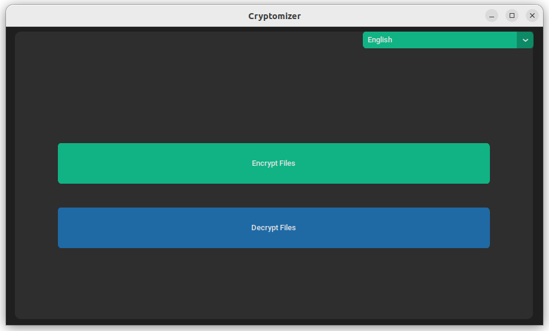
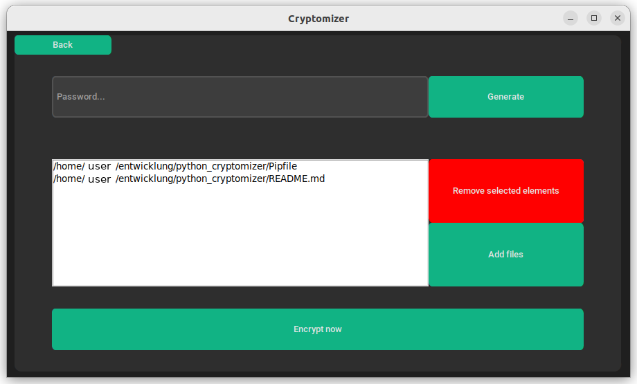

# Cryptomizer

> Cryptomizer is an easy GUI based file de- and encryption tool for linux, windows and mac.





[[Deutsche Anleitung](README_DE.md)]

## Table of contents
1. [How to use Cryptomizer as normal user](#how-to-use-cryptomizer-as-normal-user)
2. [Supported languages](#supported-languages)
3. [Installation for developers](#installation-for-developers)
4. [Commands](#commands)
5. [Sources](#sources)

## How to use Cryptomizer as normal user
1. First go the [releases page](https://github.com/richard-llmnn/cryptomizer/releases) and select the version you want.  
2. Download the `cryptomizer-[your_operating_system].zip` file for your operating system.  
3. Unzip the folder and run the program.

## Supported languages
- English
- German
- Chinese
- Arabic
- Spanish

## Installation for developers
1. Check if you Python version is at least **3.10!**
2. Please install pipenv at first `pip install pipenv` -> [alternative installation methods](https://pypi.org/project/pipenv/)
3. Pull the repository
4. Run `pipenv install`

## Commands

### In the pipenv shell run
```
pipenv run python src/main.py
```

## Sources
- [Built-in packages](https://docs.python.org/3/py-modindex.html)
- [Tkinter tutorial](https://blog.teclado.com/tkinters-grid-geometry-manager/)
- [Github workflow tutorial](https://www.ipswitch.com/blog/how-to-build-your-first-github-actions-workflow)
